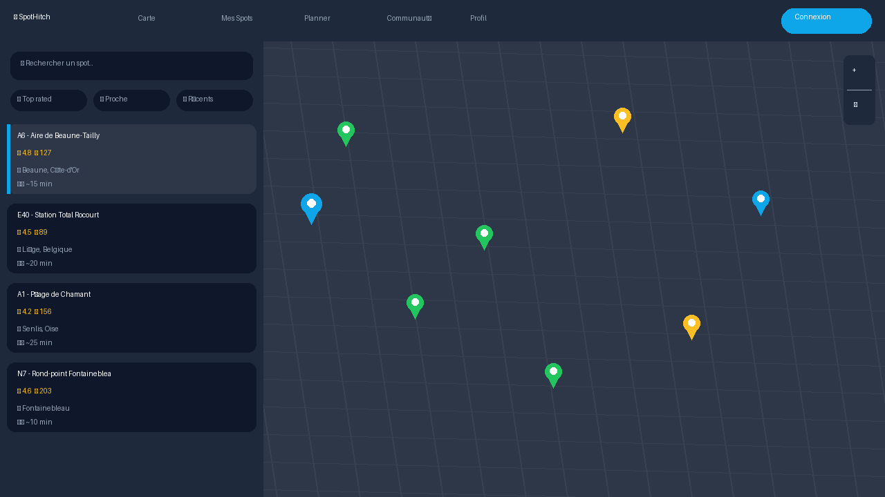

# 🚗 SpotHitch

> **La communauté des autostoppeurs** - Une Progressive Web App pour trouver et partager les meilleurs spots d'autostop en Europe.

[](https://opensource.org/licenses/MIT)
[](https://antoine626.github.io/Spothitch/)
[](https://antoine626.github.io/Spothitch/)
[](https://github.com/antoine626)

---

## 🌐 Démo Live

**[➡️ Lancer SpotHitch](https://antoine626.github.io/Spothitch/)**

<p align="center">
  
  
</p>

---

## ✨ Fonctionnalités

### 🗺️ Carte Interactive
- Visualisation de +40 spots d'autostop vérifiés en Europe
- Filtres par pays, note, popularité
- Clustering automatique des markers
- Recherche de lieux avec Nominatim

### 📍 Gestion des Spots
- Ajouter des spots avec photo obligatoire
- Système de validation GPS (être sur place)
- Notes et avis détaillés (sécurité, accessibilité, temps d'attente)
- Check-in pour confirmer l'utilisation

### 🛣️ Planificateur de Voyage
- Créer des itinéraires multi-étapes
- Calcul automatique des routes avec OSRM
- Suggestions des meilleurs spots sur le trajet
- Sauvegarde et export des voyages

### 🎮 Gamification
- Système de points et niveaux (Novice → Légende)
- 20+ badges à débloquer
- Ligues compétitives (Bronze → Diamant)
- Missions quotidiennes et hebdomadaires
- Leaderboard communautaire

### 💬 Communauté
- Chat en temps réel par catégories
- Système d'amis et statuts
- Guides par pays (légalité, conseils, urgences)
- Mode SOS avec partage de position

### 📱 PWA Complète
- Installation sur mobile/desktop
- Mode hors-ligne avec cache intelligent
- Synchronisation en arrière-plan
- Notifications push (bientôt)

---

## 🚀 Installation

### Utiliser l'application

1. Visitez **[https://antoine626.github.io/Spothitch/](https://antoine626.github.io/Spothitch/)**
2. Sur mobile : Menu → "Ajouter à l'écran d'accueil" ou cliquez sur le bouton d'installation
3. Sur desktop : Cliquez sur l'icône 📥 dans la barre d'adresse Chrome

### Développement local

```bash
# Cloner le repo
git clone https://github.com/antoine626/Spothitch.git
cd Spothitch

# Option 1: Python
python -m http.server 8000

# Option 2: Node.js
npx serve .

# Option 3: VS Code Live Server
# Installer l'extension Live Server et cliquer "Go Live"
```

Puis ouvrir `http://localhost:8000`

---

## 📁 Structure du Projet

```
Spothitch/
├── index.html          # Application principale (SPA monofichier)
├── manifest.json       # Configuration PWA
├── sw.js              # Service Worker (cache offline)
├── offline.html       # Page de fallback hors-ligne
├── firestore.rules    # Règles de sécurité Firebase
├── icon-*.png         # Icônes PWA (72-512px)
├── screenshot-*.png   # Captures d'écran pour installation
├── favicon.png        # Favicon
├── LICENSE            # Licence MIT
└── README.md          # Documentation
```

---

## 🛠️ Technologies

| Catégorie | Technologies |
|-----------|-------------|
| **Frontend** | HTML5, CSS3 (Tailwind), JavaScript ES6+ |
| **Cartographie** | Leaflet.js, MarkerCluster, OSRM |
| **Backend** | Firebase (Auth, Firestore, Storage) |
| **PWA** | Service Worker, Web App Manifest, IndexedDB |
| **Géolocalisation** | Nominatim, Navigator.geolocation |

---

## 🗺️ Roadmap

### ✅ Complété
- [x] PWA installable avec icônes
- [x] Mode offline avec Service Worker
- [x] Cache intelligent (IndexedDB + localStorage)
- [x] Carte interactive avec 40+ spots
- [x] Système de gamification complet
- [x] Chat communautaire
- [x] Guides par pays
- [x] Mode SOS

### 🔄 En cours
- [ ] Compression automatique des photos
- [ ] Debounce API OSRM
- [ ] Synchronisation offline → online

### 📋 Planifié
- [ ] Push notifications
- [ ] Background sync
- [ ] Leaderboard Firebase temps réel
- [ ] Export GPX des itinéraires
- [ ] Mode sombre automatique
- [ ] Publication Google Play Store
- [ ] Publication Apple App Store

---

## 🤝 Contribuer

Les contributions sont les bienvenues ! 

1. Fork le projet
2. Créer une branche (`git checkout -b feature/ma-feature`)
3. Commit (`git commit -m 'Ajout de ma feature'`)
4. Push (`git push origin feature/ma-feature`)
5. Ouvrir une Pull Request

### Code Style
- JavaScript: ES6+, async/await
- Indentation: 4 espaces
- Nommage: camelCase

---

## 🔒 Sécurité

- Toutes les entrées utilisateur sont échappées avec `escapeHtml()`
- Firebase Security Rules pour Firestore
- Validation GPS côté client (amélioration serveur à venir)
- Pas de stockage de mots de passe (Firebase Auth)

---

## 📄 Licence

Ce projet est sous licence **MIT** - voir le fichier [LICENSE](LICENSE) pour plus de détails.

---

## 👤 Auteur

**antoine626**

- GitHub: [@antoine626](https://github.com/antoine626)
- Application: [SpotHitch](https://antoine626.github.io/Spothitch/)

---

## 💖 Remerciements

- [Hitchwiki](https://hitchwiki.org) pour l'inspiration et les données de spots
- [Leaflet](https://leafletjs.com) pour la cartographie
- [Firebase](https://firebase.google.com) pour le backend
- [OSRM](http://project-osrm.org) pour le routing
- La communauté des autostoppeurs 🚗👍

---

<p align="center">
  ⭐ Si ce projet vous plaît, n'hésitez pas à lui donner une étoile !<br>
  <strong>Bon voyage et bon stop ! 🚗👍</strong>
</p>
